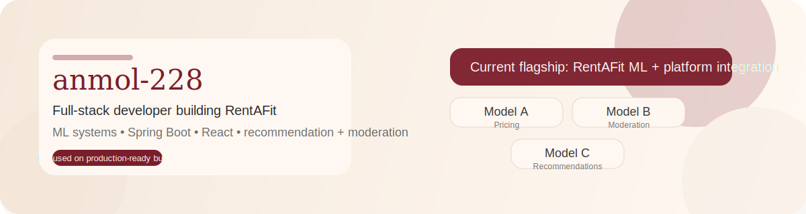

  

  <a href="https://github.com/anmol-228?tab=repositories">Repositories</a> ·
  <a href="https://github.com/anmol-228/RentAFit-ML">RentAFit-ML</a>

## About Me

- B.Tech CSE student at **Amity University, Kolkata (2023–2027)** with a **CGPA of 9.26**.
- Interested in building scalable software systems and using analytical thinking to solve real-world problems.
- Comfortable across **Java, Python, C, JavaScript, HTML, CSS, React, Spring Boot, MySQL, and Neo4j**.
- Also work with **Pandas, NumPy, scikit-learn, Random Forest, feature engineering, and REST APIs**.

## Experience

### Research Intern — ISRIP, Amity University
- Worked with **Neo4j, Cypher, and graph databases**.
- Built graph-based data models using datasets such as **IMDb Top 100 Movies** and **Spotify Top 100 Songs**.
- Studied recommendation-system literature and explored graph-based recommendation design.

## Projects

### RentAFit
ML-powered fashion rental platform with pricing, moderation, and recommendation systems.
- Built around **price prediction, listing moderation, and renter-side recommendation flows**.
- Connects **Python-based ML pipelines** with broader product integration work around **React and Spring Boot**.
- Focused on safe predictions, lifecycle-aware moderation, and explainable recommendation behavior.
- Repository: [RentAFit-ML](https://github.com/anmol-228/RentAFit-ML)

### Sahayatri
Role-based intelligent transport tracking prototype.
- Built with **HTML, CSS, JavaScript, Bootstrap, OpenStreetMap (Leaflet), MySQL, and Spring Boot**.
- Focused on route discovery, bus tracking, and scalable transport-system design.
- Repository: [Sahayatri](https://github.com/anmol-228/Sahayatri)

## Skills

  
  
  
  
  
  
  
  
  
  
  

- **Core concepts:** Data Structures, OOP, DBMS, Computer Networks, REST APIs
- **ML tools:** Pandas, NumPy, Random Forest, regression, feature engineering, Matplotlib, Joblib
- **Other tools:** Excel, Power BI

## GitHub Stats

  
  

## Current Direction

- strengthening full-stack project work across backend, frontend, and data systems
- building more production-ready ML-backed applications
- improving system design, API development, and real-world software workflows
