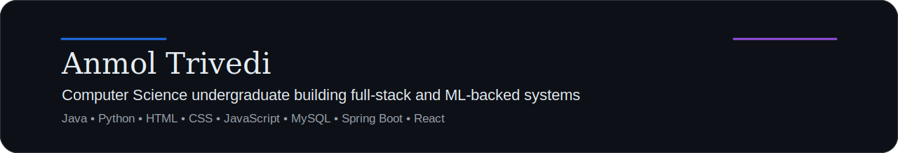

  

  Computer Science undergraduate focused on backend systems, full-stack product work, and practical machine learning.

  Kolkata, West Bengal, India ·
  <a href="https://github.com/anmol-228?tab=repositories">All repositories</a> ·
  <a href="https://github.com/anmol-228/RentAFit-ML">RentAFit-ML</a>
  ·
  <a href="https://github.com/anmol-228/RentAFit-Frontend">RentAFit-Frontend</a>

## About Me

- B.Tech CSE student at **Amity University, Kolkata (2023–2027)** with a **CGPA of 9.26**.
- Interested in building structured software systems that connect product thinking, backend design, and practical ML.
- Comfortable across **Java, Python, C, JavaScript, HTML, CSS, React, Spring Boot, MySQL, and Neo4j**.
- Also work with **Pandas, NumPy, scikit-learn, Random Forest, feature engineering, and REST APIs**.

## Selected Work

<table>
  <tr>
    <td width="50%" valign="top">
      <h3>RentAFit</h3>
      
ML-powered fashion rental platform centered on pricing, moderation, and recommendation workflows.

      
<strong>Focus:</strong> safe model outputs, product-facing logic, and explainable decision support.

      
<strong>Stack:</strong> Python, scikit-learn, React, Spring Boot

      
<a href="https://github.com/anmol-228/RentAFit-ML">Open RentAFit-ML</a>

    </td>
    <td width="50%" valign="top">
      <h3>Sahayatri</h3>
      
Role-based transport tracking prototype built around route discovery and live system flows.

      
<strong>Focus:</strong> route search, tracking interfaces, and backend-backed transport operations.

      
<strong>Stack:</strong> HTML, CSS, JavaScript, Bootstrap, Leaflet, MySQL, Spring Boot

      
<a href="https://github.com/anmol-228/Sahayatri">Open Sahayatri</a>

    </td>
  </tr>
</table>

## Experience

### Research Intern — ISRIP, Amity University
- Worked with **Neo4j, Cypher, and graph databases**.
- Built graph-based data models using datasets such as **IMDb Top 100 Movies** and **Spotify Top 100 Songs**.
- Studied recommendation-system literature and explored graph-based recommendation design.

## Stack

  

  

- **Core concepts:** Data Structures, OOP, DBMS, Computer Networks, REST APIs
- **ML tools:** Pandas, NumPy, Random Forest, regression, feature engineering, Matplotlib, Joblib
- **Other tools:** Excel, Power BI

## GitHub Overview

  

## Language Overview

  

## Current Direction

- strengthening full-stack project work across backend, frontend, and data systems
- building more production-ready ML-backed applications
- improving system design, API development, and real-world software workflows
